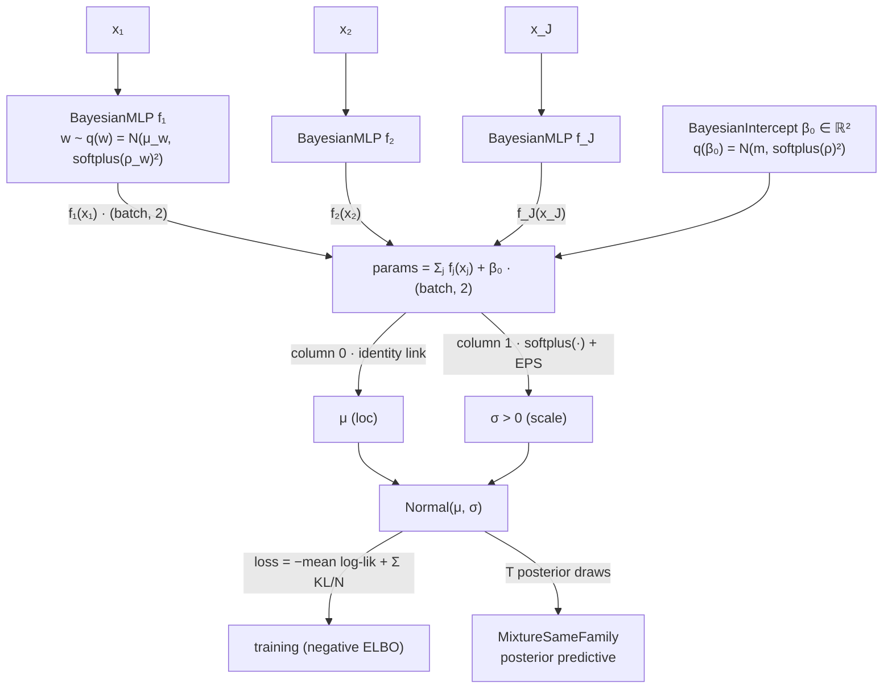

# DUNE — Distributional Uncertainty in Neural-additive Estimation

Bayesian additive models for location, scale, and shape — neural shape
functions with mean-field variational inference, in PyTorch. Distributed
as the `dune-bayes` package (`import dune_bayes`).

`dune-bayes` builds on the NAMLSS framework
([Thielmann et al., 2024](https://proceedings.mlr.press/v238/frederik-thielmann24a.html))
and makes it Bayesian. As in NAMLSS, each feature gets its own small neural
network (a *shape function*) that contributes to **every parameter** of a
response distribution (location *and* scale *and* shape); DUNE additionally
puts a variational posterior on the network weights — so every feature effect
comes with a credible band, not just a point curve. The Bayesian treatment of
distributional regression follows the spirit of the
[BAMLSS](https://cran.r-project.org/package=bamlss) R package.

Three goals, in priority order:

1. **Epistemic uncertainty on effects** — credible intervals around each
   feature's shape function, separated from the family's aleatoric noise.
2. **Priors as principled regularization** — the per-feature `prior_scale` is
   the direct analog of an mgcv smoothing parameter (fixed, empirical-Bayes,
   or fully hierarchical).
3. **Principled model comparison** — WAIC and PSIS-LOO (via
   [arviz](https://python.arviz.org)) across candidate formulas, including
   deterministic baselines.

## Status

Pre-v1 research software (`0.1.0.dev0`). The statistical design is settled
(see [`docs/adr/`](docs/adr/)) and the core path — formula → fit → effect
bands → WAIC/LOO — works and is tested, but the API may still change without
deprecation. Python 3.12+, CPU by default, CUDA opt-in. Publication metadata for
the planned `v0.1.0-paper` artifact release lives in
[`experiments/publication/release-metadata.yaml`](experiments/publication/release-metadata.yaml);
the final paper/preprint citation and Zenodo DOI remain pending author approval.

## Install

Not yet on PyPI. Install from a clone (we use [uv](https://docs.astral.sh/uv/)):

```sh
git clone git@github.com:RMKruse/dune-bayes.git
cd dune-bayes
uv pip install -e .
```

## Quick example: fit → plot → compare

```python
import torch
from dune_bayes.model import BayesianNAMLSS
from dune_bayes.families import NormalFamily
from dune_bayes.metrics import variance_decomposition
from dune_bayes.sampling import draw_predictive, sample_effects
from dune_bayes.plotting import plot_dist, plot_effect_ribbon
from dune_bayes.compare import compare

# Toy data: nonlinear effect on the mean, Gaussian noise.
n = 500
x1, x2 = torch.rand(n, 1), torch.rand(n, 1)
y = torch.sin(6 * x1).squeeze(-1) + 0.5 * x2.squeeze(-1) + 0.1 * torch.randn(n)
X = {"x1": x1, "x2": x2}

# mgcv-style formula; one shape function per term, Bayesian or deterministic.
model = BayesianNAMLSS.from_formula(
    "y ~ BayesianMLP(x1) + NeuralLinearMLP(x2)", family=NormalFamily(), n_obs=n
)
model.fit(X, y, epochs=200)

# Per-feature effect bands: T posterior draws -> centered 90% credible ribbon.
draws = sample_effects(model, X, T=200)        # {feature: Tensor[T, n, param_count]}
plot_effect_ribbon(draws["x1"], x1.squeeze(-1))

# Response-level posterior predictive band: epistemic + aleatoric uncertainty.
predictive = draw_predictive(model, X, T=200)
plot_dist(predictive.predictive, y)
uncertainty = variance_decomposition(model, predictive.summed_samples)

# Bayes-vs-deterministic comparison, ranked by PSIS-LOO.
baseline = BayesianNAMLSS.from_formula(
    "y ~ MLP(x1) + MLP(x2)", family=NormalFamily(), n_obs=n
)
baseline.fit(X, y, epochs=200)
print(compare({"bayesian": model, "deterministic": baseline}, X, y))
```

Shape functions available in formulas: `BayesianMLP` (fully variational),
`NeuralLinearMLP` (deterministic hidden layers, variational output — cheaper),
and the deterministic baselines `MLP` and `ResNet`. Interactions are joint
nets over multiple inputs (`BayesianMLP(x1):BayesianMLP(x2)`); categorical
features become Bayesian embeddings — the neural analog of a random effect,
with partial pooling of rare levels. Families shipped so far:
`NormalFamily`, `StudentTFamily`, `GammaFamily`.

The effect ribbon is a centered per-feature shape-function summary, so it shows
epistemic uncertainty in one learned contribution. The response band comes from
the posterior predictive distribution and includes aleatoric uncertainty from
the family as well; `variance_decomposition` reports that split numerically.

## Architecture

How a fitted `y ~ Normal(μ, σ)` model is assembled — one Bayesian shape
function per feature, each contributing additively to **both** distributional
parameters:



Every dense layer is a `VariationalDense` (mean-field Gaussian posterior over
weights), so σ is feature-dependent — heteroscedastic by construction — and
every effect carries an epistemic credible band. Other families work the same
way: the family's `param_count` sets the output width (`StudentTFamily` → 3
columns, `GammaFamily` → 2). The full walkthrough lives in
[`docs/architecture.md`](docs/architecture.md).

## Documentation

- [`CONTEXT.md`](CONTEXT.md) — the statistical contract and glossary (start here).
- [`docs/tutorials/reader_workflow.md`](docs/tutorials/reader_workflow.md) — a
  short formula → fit → effect ribbon → posterior predictive band tutorial.
- [`docs/architecture.md`](docs/architecture.md) — the model graph: feature
  nets → additive sum → family links → ELBO / posterior predictive.
- [`docs/adr/`](docs/adr/) — the six design decisions (inference engine,
  priors-as-smoothness, predictive/comparison architecture, the
  `VariationalDense` atom, categoricals & interactions, PyTorch backend).
- [`docs/prd/`](docs/prd/) and [`docs/issues/`](docs/issues/) — scope and
  acceptance criteria.

## Citing

Citation metadata is recorded in [`CITATION.cff`](CITATION.cff). Until the
planned `v0.1.0-paper` artifact release is tagged and archived on Zenodo, please
cite the repository and the NAMLSS framework it builds on. The dune-bayes
preferred paper citation in `CITATION.cff` is a pending slot and must be replaced
with the author-approved preprint or submission citation before the release tag.

> Thielmann, A. F., Kruse, R.-M., Kneib, T., & Säfken, B. (2024). Neural
> additive models for location scale and shape: A framework for interpretable
> neural regression beyond the mean. *Proceedings of the 27th International
> Conference on Artificial Intelligence and Statistics (AISTATS)*, PMLR
> 238:1783–1791.

The Bayesian distributional-regression methodology it draws on:

> Umlauf, N., Klein, N., & Zeileis, A. (2018). BAMLSS: Bayesian additive
> models for location, scale, and shape (and beyond). *Journal of
> Computational and Graphical Statistics*, 27(3), 612–627.

## License

[MIT](LICENSE)
