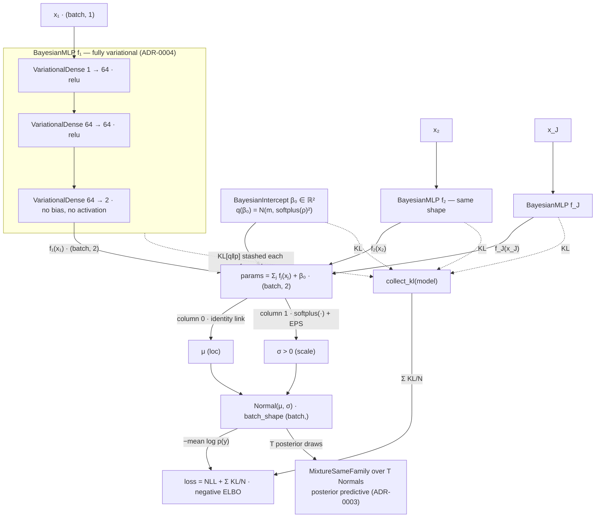

# Architecture — estimating a Normal(μ, σ) with Bayesian feature nets

How `BayesianNAMLSS` assembles a distributional regression model, shown for
the Normal family (`NormalFamily`, `param_count = 2`). The statistical
contract and glossary live in [`CONTEXT.md`](../CONTEXT.md); the decisions
behind each box are in [`docs/adr/`](adr/). This page is the map between the
two: which module does what, in dataflow order.

The running example is the formula

```text
y ~ BayesianMLP(x1) + BayesianMLP(x2) + … + BayesianMLP(xJ)
```

## The model graph



## Walkthrough

**Per-feature shape functions** (`shapes/bayesian_mlp.py`). Each feature gets
its own `BayesianMLP` mapping `(batch, in_features)` to
`(batch, param_count)`. With the Normal family that is two output columns —
one contribution to the location, one to the (pre-link) scale. Because every
feature contributes to *both* columns, σ is feature-dependent: the model is
heteroscedastic by construction, not a constant-noise regression.

**The variational atom** (`layers/variational_dense.py`, ADR-0004). Every
dense layer is a `VariationalDense`: each weight has a mean-field Gaussian
posterior `w ~ q(w) = N(μ_w, softplus(ρ_w)²)`, sampled by reparameterization
on every forward pass. Positivity of the posterior std goes through
`softplus`, never `exp` or `clamp` (numerical rule 1). The KL against the
`N(0, prior_scale²)` weight prior is closed-form Gaussian–Gaussian (rule 4)
and is stashed on the layer at each forward. `prior_scale` is the per-feature
smoothness knob (ADR-0002) — fixed, empirical-Bayes, or hierarchical via the
`PriorScale` handle.

**The model-owned intercept** (`layers/bayesian_intercept.py`, issue 0010).
Shape-function output layers are bias-free, so the overall level of each
distributional parameter — and its uncertainty — accumulates in one
reportable `BayesianIntercept` posterior `β₀ ∈ ℝ^param_count` instead of
hiding in layer biases. This keeps mean-centred effect plots honest.

**Additive sum → family links** (`model.py`, `families/normal.py`). The model
sums the per-feature outputs and the intercept into a `(batch, 2)` parameter
tensor, then hands it to the family. `NormalFamily` applies the links:
identity for `loc`, `softplus(·) + EPS` for `scale` — the EPS floor guards
the float32 corner where bare softplus underflows to exact 0 and poisons
`log_prob` (numerical rule 1). The result is a
`torch.distributions.Normal` with `batch_shape (batch,)`.

**Training** (`model.fit` / `model.loss`). One stochastic forward pass per
step; the objective is the negative ELBO

```text
loss = −mean log p(y | μ, σ)  +  Σ KL[q(w) ‖ p(w)] / N
```

`collect_kl` walks the module tree and must reach **every**
`VariationalLayer` — all `VariationalDense` layers and the intercept. A
Bayesian module contributing zero KL is a bug, not an optimization
(numerical rule 5).

**Inference** (`sampling/`, ADR-0003). `sample_posterior_predictive(X, T)`
takes `T` coherent weight draws and returns a `MixtureSameFamily` over `T`
Normals: the spread of the `T` mean curves is the **epistemic** band (weight
posterior), while σ itself carries the **aleatoric** noise — the
decomposition Goal 1 reports. `sample_effects` produces the per-feature
`[T, n, param_count]` draws behind the credible ribbons, and
`LogLikSampler` feeds the pointwise log-likelihood matrix (accumulated in
float64) to WAIC / PSIS-LOO in `compare/`.

The reader-facing plots keep those concepts separate. An **effect ribbon** is
a centered per-feature, per-parameter summary of epistemic shape-function
uncertainty. A **response-level** predictive band comes from the posterior
predictive mixture and includes both epistemic spread across weight draws and
aleatoric spread within the response family. Aleatoric noise is therefore never
attributed to an individual feature curve.

## Other families

Nothing above is Normal-specific except the link table. The family's
`param_count` sets the output width of every shape function and the
intercept; the family applies its own links column-by-column:

| Family | `param_count` | Links (per column) |
| --- | --- | --- |
| `NormalFamily` | 2 | identity (μ) · softplus + EPS (σ) |
| `GammaFamily` | 2 | softplus + EPS (concentration) · softplus + EPS (rate) |
| `StudentTFamily` | 3 | identity (μ) · softplus + EPS (σ) · softplus + EPS + `df_min` (df) |
| `JohnsonSUFamily` | 4 | identity (skew) · softplus + EPS (tailweight) · identity (loc) · softplus + EPS (scale) |
| `NegativeBinomialFamily` | 2 | softplus + EPS (mean) · softplus + EPS (dispersion) |
| `BetaFamily` | 2 | floored sigmoid (mean in (0, 1)) · softplus + EPS (precision) |

Mixed formulas work the same way: deterministic shape functions (`MLP`,
`ResNet`) drop into the same sum as zero-KL contributors, `NeuralLinearMLP`
keeps only its output layer variational, and categorical features enter
through `BayesianEmbedding` (ADR-0005) — all upstream of the unchanged
sum → links → family tail.
